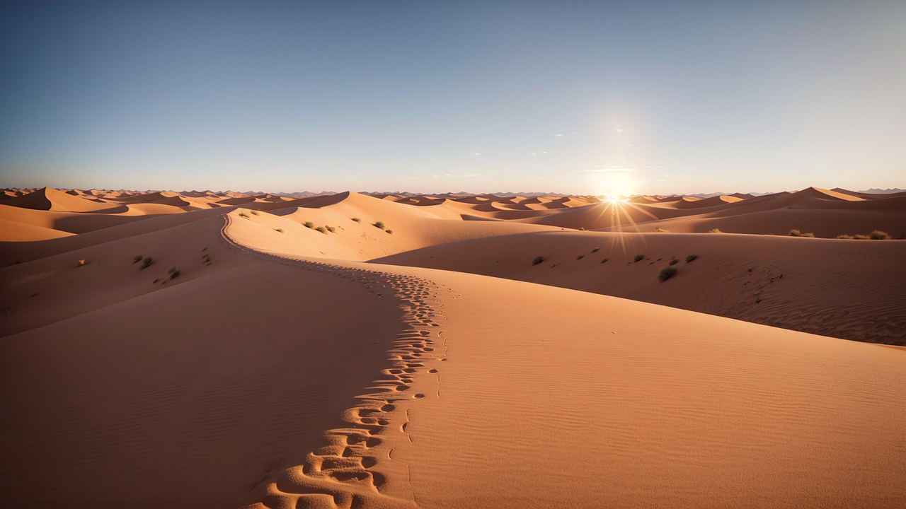
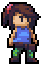

# 프로젝트명: follow-up trip

# [컨셉]

## 메인컨셉 : 성취감

- 누적된 결과물들로 인한 성취감을 느끼게 해주고 싶음

### 서브 컨셉 1 :

- Stage & 여러 스테이지를 클리어 하거나 맵을 확장시킴으로써 성취감을 얻음

### 서브 컨셉 2 :

- Story & 메인 스토리를 진행해 나가면서 새로운 정보를 알아가는 데에서 성취감을 얻음

### 서브 컨셉 3 :

- Illustration & 뷰포인트에서 해당 지역의 풍경을 감상하면서 성취감을 얻음

### 서브 컨셉 4 :

- Easter egg & 게임 곳곳에 숨겨져있는 이스터에그들을 발견해 나가면서 성취감을 얻음

  

# [관련 이미지 & 동영상]

- 이미지  
  
  

  

# [대표 이미지]

  

# [<follow-up trip> 구성 요소]

- 아버지의 흔적을 찾아가며 세상의 다양한 풍경을 수집해가는 2d 플랫포머 게임

 

## 1. 메커니즘

[도전 과제]

1. 수많은 장애물을 통과해가며 맵을 확장해나가라
2. 맵 곳곳에 숨겨져있는 아버지의 흔적과 상호작용하고 스토리를 진행해나가라
3. 맵 곳곳에 숨겨져있는 전망포인트를 찾고 다양한 풍경을 수집해라 

[재미 요소]

1. 다양한 배경과 그에 맞는 배경음악으로 게임을 풍부하게 만듬
2. 매번 진행되는 스토리로 다음 스토리에 대한 호기심을 자극함
3. 전망포인트에서 얻을 수 있는 다양한 풍경을 보면서 상상력을 자극함

 

## 2. 이야기

[만들게 된 배경]  
제가 제작하는 게임에 스토리 요소를 꼭 넣어보고 싶었고 여러 현실적인 문제로 가보지 못하는 세상의 멋진 풍경들을 간접체험 시켜주고 싶어서 이러한 게임을 만들게 되었습니다. 또한 게임을 진행하는 과정에서 다양한 게임요소들을 통해 유저들에게 성취감을 느끼게 해주고 싶었기에 이러한 게임을 기획하게 되었습니다. 

 

## 3. 미적요소

[디자인]  
장애물들을 통과하고 맵을 확장해나감에 따라 조금씩 변해가는 배경,  그리고 변해가는 배경에 따라 배경음악 역시 배경에 어울리는 분위기를 조성하기 위해 알맞게 설정할 것입니다. 

[음향]  
달라지는 배경에 따라 그 배경에 어울리는 장애물 오브젝트를 디자인 하여 맵 곳곳에 배치할 것입니다. ex)설산을 배경으로 하는 맵에서는 고드름 등을 장애물로 배치

## 4. 기술

Unity 2D를 기반으로 하여 PC용 게임으로 제작, 에셋을 활용한 다양한 오브젝트 구현

## 5. 게임 오브젝트 분해 (구성 요소 분석)

|연번|종류|OBJ 이름|OBJ 영문명|사용처|오브젝트 이미지|
|:----:|:----:|:----:|:----:|:----:|:----:|
|1|캐릭터|주인공|player|공통||
|2|캐릭터|어머니|mother|스테이지1||
|3|캐릭터|상인|trader|스테이지9||
|4|캐릭터|기사|knight|스테이지4||
|5|캐릭터|여관주인|innkeeper|스테이지6||
|6|건축물|여관|inn|스테이지6||
|7|건축물|집|house|스테이지1||
|8|구조물|장애물1,2,3|hurdle1,2,3|공통||
|9|구조물|뷰포인트|viewpoint|공통||
|10|구조물|바닥|plane|공통||
|11|배경|초원, 등등 배경|grasslandBackground, etc|공통||
|12|일러스|초원, 등등 일러스|grasslandIllustration, etc|공통||
