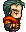

# [ 목차 ]
### 1. [컨셉](#1)
### 2. [관련 이미지와 동영상](#2)
### 3. [대표 이미지 그리고 컨셉과 대표이미지 기반 작품 묘사](#3)
### 4. [follow-up trip 구성 요소](#4)
### 5. [게임 시스템 디자인](#5)
### 6. [요구사항(6주차)](#6)
### 7. [요구사항(1년차)](#7)

# 프로젝트명: follow-up trip

# 1. [컨셉] 

## 메인컨셉 : 성취감

- 누적된 결과물들로 인한 성취감을 느끼게 해주고 싶음

### 서브 컨셉 1 :

- Stage & 여러 스테이지를 클리어 하거나 맵을 확장시킴으로써 성취감을 얻음

### 서브 컨셉 2 :

- Story & 메인 스토리를 진행해 나가면서 새로운 정보를 알아가는 데에서 성취감을 얻음

### 서브 컨셉 3 :

- Illustration & 뷰포인트에서 해당 지역의 풍경을 감상하면서 성취감을 얻음

### 서브 컨셉 4 :

- Easter egg & 게임 곳곳에 숨겨져있는 이스터에그들을 발견해 나가면서 성취감을 얻음

  

# 2. [관련 이미지 & 동영상] 

- 이미지  
  
  

  

# 3. [대표 이미지 그리고 컨셉과 대표이미지 기반 작품 묘사] 

## [대표이미지 기반 작품묘사]
뷰포인트 : 맵 어딘가에 있는 뷰포인트를 찾아서 상호작용하면 대화창이 열리면서 스토리가 진행되고, 해당 지역을 보여주는 일러스트가 대화 또는 독백 도중 나타날 것입니다. 그로 인해 유저들로 하여금 상상력을 자극하게 만들고, 성취감을 얻게 될 것입니다.

  

# 4. [<follow-up trip> 구성 요소] 

- 게임 묘사 : 아버지의 흔적을 찾아가며 세상의 다양한 풍경을 알아가는 2d 플랫포머 게임

 

## 1. 메커니즘

[도전 과제]

1. 수많은 장애물을 통과해가며 맵을 통과해나가라
2. 맵 곳곳에 숨겨져있는 뷰포인트를 찾아 상호작용하고 스토리를 진행해나가라
3. 특정 기믹 혹은 준비물을 찾아서 다음 스테이지로 통과하라

[재미 요소]

1. 다양한 배경과 그에 맞는 배경음악으로 게임을 풍부하게 만듬
2. 매번 진행되는 스토리로 다음 스토리에 대한 호기심을 자극함
3. 뷰포인트에서 얻을 수 있는 다양한 풍경을 보면서 상상력을 자극함

 

## 2. 이야기

[만들게 된 배경]  
제가 제작하는 게임에 스토리 요소를 꼭 넣어보고 싶었고 여러 현실적인 문제로 가보지 못하는 세상의 멋진 풍경들을 간접체험 시켜주고 싶어서 이러한 게임을 만들게 되었습니다. 또한 게임을 진행하는 과정에서 다양한 게임요소들을 통해 유저들에게 성취감을 느끼게 해주고 싶었기에 이러한 게임을 기획하게 되었습니다. 

[카메라 관점]
사이드뷰로 진행되는 2d 플랫포머 게임

 

## 3. 미적요소

[디자인]  
장애물들을 통과하고 맵을 확장해나감에 따라 조금씩 변해가는 배경,  그리고 변해가는 배경에 따라 배경음악 역시 배경에 어울리는 분위기를 조성하기 위해 알맞게 설정할 것입니다. 

[음향]  
달라지는 배경에 따라 그 배경에 어울리는 장애물 오브젝트를 디자인 하여 맵 곳곳에 배치할 것입니다. ex)설산을 배경으로 하는 맵에서는 고드름 등을 장애물로 배치

## 4. 기술

Unity 2D를 기반으로 하여 PC용 게임으로 제작, 에셋을 활용한 다양한 오브젝트 구현

   

# 5. 게임 시스템 디자인 

## 1. 게임 오브젝트 분해 (구성 요소 분석)

|연번|종류|OBJ 이름|OBJ 영문명|사용처|오브젝트 이미지|
|:----:|:----:|:----:|:----:|:----:|:----:|
|1|캐릭터|주인공|player|공통||
|2|캐릭터|어머니|mother|스테이지1||
|3|캐릭터|상인|trader|스테이지9||
|4|캐릭터|기사|knight|스테이지4||
|5|캐릭터|여관주인|innkeeper|스테이지6||
|6|캐릭터|아버지|father|스테이지10||
|7|건축물|여관|inn|스테이지6||
|8|건축물|집|house|스테이지1||
|9|구조물|장애물1,2,3|hurdle1,2,3|공통||
|10|구조물|뷰포인트|viewpoint|공통||
|11|구조물|바닥|plane|공통||
|12|배경|초원, 등등 배경|grasslandBackground, etc|공통||
|13|일러스트|초원, 등등 일러스트|grasslandIllustration, etc|공통||

## 2. 파라미터(속성) 뽑아 보기

## 3. 게임의 규칙

게임 시작시 집에서 어머니와의 대화로 게임을 시작함. 그렇게 스토리를 진행하고 맵 곳곳에 있는 장애물과 기믹을 통과해야함. 장애물에 피격 혹은 맵 아래로 떨어질 시 각 스테이지의 처음으로 돌아가야함. 
 그렇게 장애물들과 기믹들을 뚫고 나아가서 각 지역마다 하나씩 있는 뷰포인트를 찾음. 뷰포인트에 가서 상호작용을 하면 주인공 스스로의 독백 또는 특정 npc와의 대화가 진행되면서 스토리가 진행되고, 도중에 그 지역의 일러스트를 확인할 수 있음. 
 결국 모든 맵의 뷰포인트를 찾고 스토리의 결말을 확인하여 이 게임을 클리어하는 것이 주 목적임.

  

# 6. 개발 요구사항(6주차) 

~~1. 스테이지 1은 초원을 배경으로 하고, 배경에 어울리는 bgm과 어머니 npc가 안에 있는 집이 있다.(7)~~

~~2. 집의 문 가까이서 f키로 상호작용하면 집 안으로 들어갈 수 있고, 집 안에서도 문 가까이서 f키로 상호작용하면 집 밖으로 나갈 수 있다.(8)~~

~~3. 카메라는 주인공 캐릭터를 따라다니고, 주인공 캐릭터는 a,d키로 좌우로 움직이고 space바로 점프하고 f키로 물체와 상호작용 할 수 있다.(10)~~

~~4. 게임을 처음 시작하면 주인공의 독백이 시작되는 대화창이 나타나고, 마우스 좌클릭으로 한 대화창씩 넘길 수 있다.(11)~~

~~5. 집 안에 들어가서 있는 어머니 npc와 f키로 상호작용하면 대화창이 진행되면서 게임 배경 설명과 목표를 알려준다.(12)~~

~~6. 스테이지 1은 맵의 왼쪽으로 가면 막혀있고, 오른쪽 끝으로 가면 스테이지2로 넘어갈 수 있다.(9)~~

~~7. 맵에 있는 장애물들과 충돌할 시 맵의 처음으로 돌아가게 된다.(13)~~

~~8. 스테이지 2는 스테이지 1과 동일한 배경과 bgm이 배치되고, 맵의 우상단 끝으로 가면 스테이지 3, 맵의 우하단 끝으로 가면 스테이지 5로 넘어갈 수 있다.(14)~~

~~9. 스테이지 2 중간에는 위아래로 나뉘어지는 갈림길이 있는데, 위쪽길은 벽에 막혀서 갈 수 없지만 주변에 있는 힌트로 특정 기믹을 해제하면 벽이 사라진다.(15)~~

~~10. 스테이지 2의 우상단 어딘가에 뷰포인트가 하나 있다. 이에 상호작용 시 주인공이 설원으로 갈 때의 스토리가 진행되고, 대화창 진행 도중 초원 일러스트를 볼 수 있다.(16)~~

~~11. 스테이지 2의 우하단 어딘가에 뷰포인트가 하나 있다. 이에 상호작용 시 주인공이 정글로 갈 때의 스토리가 진행되고, 대화창 진행 도중 초원 일러스트를 볼 수 있다.(17)~~

  

# 7. 개발 요구사항(1년차) 
 
1. 타이틀 씬, 인게임 씬이 있는 2d 횡스크롤 게임 제작을 목표로 한다.
2. 타이틀 씬에서는 게임 타이틀의 배경과 게임의 제목, 게임 시작 버튼이 있다.
3. 게임 시작 버튼을 누르면 인게임 씬으로 넘어간다.
4. 인게임 씬에는 스테이지가 총 1부터 10까지 존재하며, 각 스테이지에는 적절한 장애물들을 배치한다. 
5. 스테이지의 끝에 도달했음에도 다음 스테이지로 넘어가지 않는다면, 스테이지 안에 찾지 못한 뷰포인트가 있는 것이니 뷰포인트를 찾고 스토리를 진행해야만 다음 스테이지로 넘어갈 수 있다.
6. 처음 게임 시작 시에는 주인공 캐릭터가 스테이지 1에 있는 것부터 시작한다.
7. 스테이지 1은 초원을 배경으로 하고, 배경에 어울리는 bgm과 어머니 npc가 안에 있는 집이 있다. 
8. 집의 문 가까이서 f키로 상호작용하면 집 안으로 들어갈 수 있고, 집 안에서도 문 가까이서 f키로 상호작용하면 집 밖으로 나갈 수 있다.
9. 스테이지 1은 맵의 왼쪽으로 가면 막혀있고, 오른쪽 끝으로 가면 스테이지2로 넘어갈 수 있다.
10. 카메라는 주인공 캐릭터를 따라다니고, 주인공 캐릭터는 a,d키로 좌우로 움직이고 space바로 점프하고 f키로 물체와 상호작용 할 수 있다.
11. 게임을 처음 시작하면 주인공의 독백이 시작되는 대화창이 나타나고, 이 역시 f키로 한 대화창씩 넘길 수 있다.
12. 집 안에 들어가서 있는 어머니 npc와 f키로 상호작용하면 대화창이 진행되면서 게임 배경 설명과 목표를 알려준다. 
13. 맵에 있는 장애물들과 충돌할 시 맵의 처음으로 돌아가게 된다.
14. 스테이지 2는 스테이지 1과 동일한 배경과 bgm이 배치되고, 맵의 우상단 끝으로 가면 스테이지 3, 맵의 우하단 끝으로 가면 스테이지 5로 넘어갈 수 있다.
15. 스테이지 2 중간에는 위아래로 나뉘어지는 갈림길이 있는데, 위쪽길은 벽에 막혀서 갈 수 없지만 주변에 있는 힌트로 특정 기믹을 해제하면 벽이 사라진다.
16. 스테이지 2의 우상단 어딘가에 뷰포인트가 하나 있다. 이에 상호작용 시 주인공이 설원으로 갈 때의 스토리가 진행되고, 대화창 진행 도중 초원 일러스트를 볼 수 있다.
17. 스테이지 2의 우하단 어딘가에 뷰포인트가 하나 있다. 이에 상호작용 시 주인공이 정글로 갈 때의 스토리가 진행되고, 대화창 진행 도중 초원 일러스트를 볼 수 있다.
18. 스테이지 3은 설원을 배경으로 하고, 설원에 어울리는 bgm이 흘러나온다. 
19. 스테이지 3의 우측 끝 특정 부분에 도달하면 스테이지 4로 넘어갈 수 있다.
20. 스테이지 4 역시 스테이지 3과 동일한 배경과 bgm이 배치된다. 
21. 스테이지 4 어딘가에 기사 npc와 그 옆에 뷰포인트가 하나 있다. 이에 상호작용 시 주인공이 극지방으로 갈 때의 스토리가 진행되고, 대화창 진행 도중 설원 일러스트를 볼 수 있다.
22. 스테이지 4의 뷰포인트를 본 후 스테이지 4의 우측 끝 특정 부분에 도달하면 스테이지 7로 넘어갈 수 있다.
23. 스테이지 5는 정글을 배경으로 하고, 정글에 어울리는 bgm이 흘러나온다.
24. 스테이지 5의 우측 끝 특정 부분에 도달하면 스테이지 6으로 넘어갈 수 있다.
25. 스테이지 6 역시 스테이지 5와 동일한 배경과 bgm이 배치된다. 
26. 스테이지 6 어딘가에 여관과 그 옆에 여관주인, 그리고 뷰포인트가 하나 있다. 이에 상호작용 시 주인공이 사막으로 갈 때의 스토리가 진행되고, 대화창 진행 도중 정글 일러스트를 볼 수 있다. 
27. 여관 문 앞에서 상호작용하여 여관 안으로 들어갈 수 있고, 여관 안에 있는 수통과 상호작용 시 수통을 획득했다는 대화창과 함께 수통을 획득한다.
28. 이때 얻은 수통이 있어야만 후에 스테이지 6에서 스테이지 9으로 넘어갈 수 있다.
29. 수통이 없이 스테이지 6의 우측 끝 특정 부분에 도달하면 대화창으로 “사막에 가려면 물을 준비해야 할 것 같다” 라고 하며 다음 스테이지로 넘어가지 못한다.
29. 스테이지 6의 뷰포인트를 본 후 수통을 챙기고 스테이지 6의 우측 끝 특정 부분에 도달하면 스테이지 9로 넘어갈 수 있다.
30. 스테이지 7은 극지방을 배경으로 하고, 극지방에 어울리는 bgm이 흘러나온다.
31. 스테이지 7의 우측 끝 특정 부분에 도달하면 스테이지 8로 넘어갈 수 있다.
32. 스테이지 8 역시 스테이지 7과 동일한 배경과 bgm이 배치된다.
33. 스테이지 8 어딘가에 뷰포인트가 있다. 이에 상호작용 시 아버지가 사막으로 향했다는 것을 깨닫는 스토리가 진행되고, 대화창 진행 도중 극지방 일러스트를 볼 수 있다. 또한, 아버지의 물건을 얻고 후에 스테이지 9에서 상인 npc를 만났을 때 도움이 된다.
34. 스테이지 9는 사막을 배경으로 하고, 사막에 어울리는 bgm이 흘러나온다.
35. 스테이지 9 어딘가에 상인, 그리고 뷰포인트가 하나 있다. 이에 상호작용 시 주인공과 상인의 대화가 진행되고, 대화창 진행 도중 사막 일러스트를 볼 수 있다.
36. 스테이지 9의 우측 끝 특정 부분에 도달 시에 스테이지 8에서 얻을 수 있는 아버지의 물건을 가지고 있다면, 상인과 추가 대화 후 상인은 주인공이 아버지 npc의 아들인 것을 깨닫고 주인공을 스테이지 10에 가셨던 아버지에게 대려다주기 위해 동행하게 된다. 이렇게 스토리가 진행된 후 스테이지 9에서 스테이지 10으로 넘어간다.
37. 스테이지 10 역시 스테이지 9와 동일한 배경과 bgm이 배치된다.
38. 스테이지 10 어딘가에 아버지npc가 있다. 아버지와 상호작용시 아버지와 대화 후 집으로 돌아오며 스토리가 마무리되고 게임 엔딩 화면과 함께 끝이 난다.

